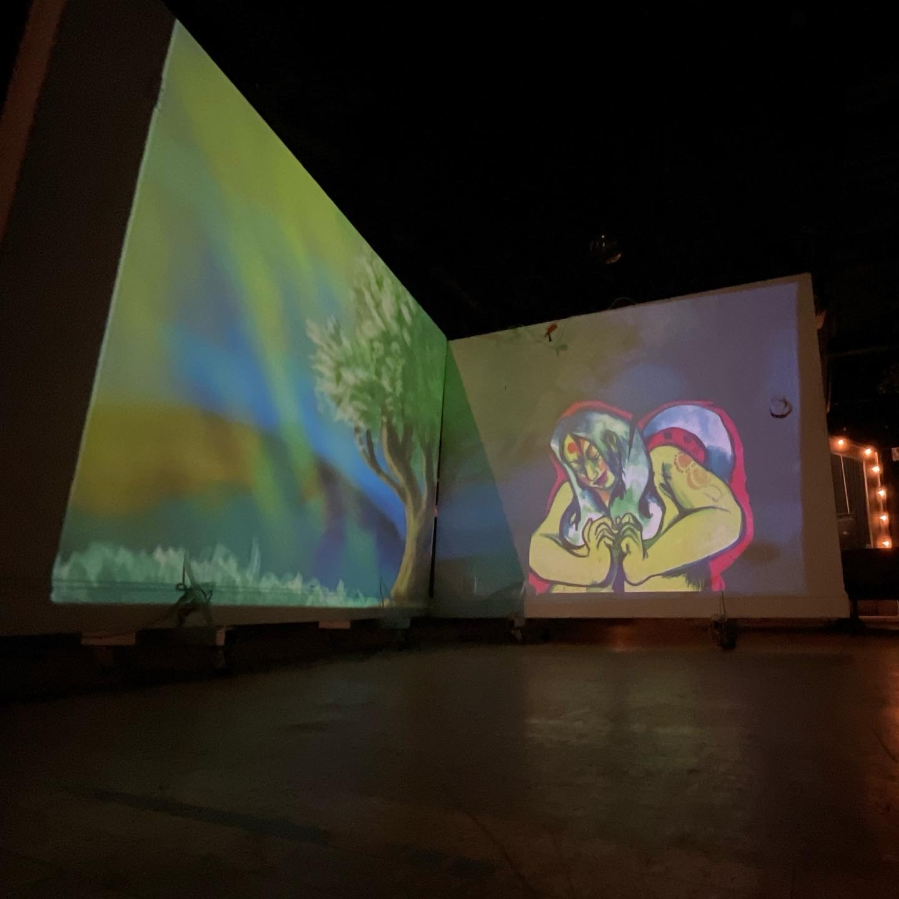

# Light Projection Projects at SudoRoom

This is an informal directory with details and tidbits about light projection projects at the [SudoRoom](https://sudoroom.org) hackerspace in Oakland.

## Overview

Light projection / projection mapping is really fun and this project explores mixing art, laser projection technology, light projectors, and having fun. 

Some themes explored so far:

* Laser projection technology
  * Blue laser projection lights were only made possible since 2008
  * New laser projectors are tiny and so fun!
* The history of light projection technology
* Artists and laser projection
	* The most interesting and effective "augmented reality art"  I've seen so far
	* Cool projects to inspire us
	* Using SudoRoom as a creative space to "riff" 
	* Mixing augmented reality and laser projection
* There's a lot of math in laser projection!

This repo will hold stuff that we can't really put into the wiki (files, movies, etc)

### Related Sites

* [Projection Mapping wiki at SudoRoom](https://sudoroom.org/wiki/ProjectionMapping)
* [Light Projection Blog Posts at SudoRoom](https://sudoroom.org/tag/light-projection-mapping-2/)	 

-----

## Experiments at SudoRoom

Photo of a collaboration between miromi + brian kolm 

There are a number of movable walls at the OmniCommons Ballroom at SudoRoom, making them perfect for creating imaginary spaces!